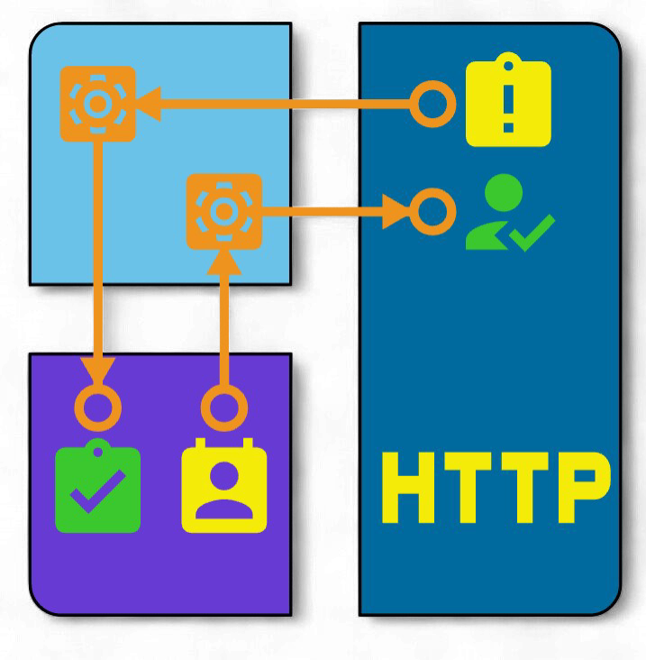

# Data Exchange Service (Сервис данных для обмена)

[](https://opensource.org/licenses/Apache-2.0)
[](https://www.python.org/downloads/)
[](https://flask.palletsprojects.com/)
[](https://www.microsoft.com/windows)
[](https://github.com/SkvorcovKV/data-exchange-service/releases)

<p align="center">
  
</p>

## 📋 О проекте

**Data Exchange Service** — это тестовый эмулятор внешнего сервиса,
 разработанный для наглядной демонстрации и тестирования возможностей
 интеграции службы **«ЭНТ Контроль доступа - Обмен данными»** с системами
 контроля и управления доступом (СКУД) «ЭНТ Контроль доступа».

### 🎯 Назначение

Сервис выступает в роли **имитатора внешней системы**, позволяя:

1. **Тестировать интеграцию** без необходимости подключения к реальным внешним сервисам
2. **Визуализировать процесс обмена данными** между СКУД и внешней системой
3. **Отлаживать** взаимодействие на всех этапах: от загрузки пользователей до приема событий
4. **Демонстрировать** возможности интеграции заказчикам и партнерам

### 🔄 Принцип работы

В связке с программой «Обмен данными» (в составе СКУД «ЭНТ Контроль доступа») сервис обеспечивает:
```
┌─────────────────┐         ┌─────────────────┐         ┌──────────────────┐
│  Data Exchange  │         │     Служба      │         │  СКУД ЭНТ        │
│    Service      │ ◄─────► │  «Обмен данными»│ ◄─────► │  Контроль доступа│
│   (эмулятор)    │         │                 │         │                  │
└─────────────────┘         └─────────────────┘         └──────────────────┘
        │                           │                            │
        │                           │                            │
        ▼                           ▼                            ▼
   ┌───────────┐              ┌───────────┐                 ┌───────────┐
   │  Выгрузка │              │  Передача │                 │  События  │
   │пользоват. │              │  событий  │                 │  доступа  │
   └───────────┘              └───────────┘                 └───────────┘
```

**Основные процессы:**

- 📤 **Выгрузка пользователей** — служба «Обмен данными» запрашивает список сотрудников из Data Exchange Service и загружает их в СКУД
- 📥 **Загрузка событий** — события проходов из СКУД передаются через службу «Обмен данными» в Data Exchange Service для обработки и хранения
- 👁️ **Визуализация** — веб-интерфейс позволяет наблюдать за процессом в реальном времени

## ✨ Возможности

### Для тестирования и отладки

- ✅ **Полная эмуляция** внешнего сервиса с REST API
- ✅ **Прозрачность** — все запросы и ответы логируются
- ✅ **Расширенный режим отладки** — детальное логирование для анализа
- ✅ **Ручное управление данными** — создание, редактирование и удаление пользователей через веб-интерфейс
- ✅ **Просмотр событий** — все полученные от СКУД события отображаются в реальном времени

### Для демонстрации

- ✅ **Наглядный веб-интерфейс** с вкладками для всех сущностей
- ✅ **Автоматическая конвертация ключей** — поддержка HEX и DEC форматов
- ✅ **Поддержка кириллицы** — корректная работа с русскими ФИО
- ✅ **Автономность** — не требует установки Python или дополнительных серверов БД
- ✅ **Кроссплатформенность** — работает на любой Windows-системе (64-bit)

## 🛠 Технологический стек

| Компонент | Технология | Назначение |
|-----------|------------|------------|
| **Backend** | Python 3.14 + Flask 3.1 | REST API сервер |
| **Frontend** | HTML5, CSS3, JavaScript (ES6+) | Веб-интерфейс |
| **База данных** | SQLite | Хранение пользователей и событий |
| **Сборка** | PyInstaller 6.19 | Создание автономного exe-файла |
| **Формат данных** | JSON (UTF-8) | Обмен с внешними системами |

## 📦 Установка и запуск

### Системные требования

| Компонент | Минимальные требования | Рекомендуемые требования |
|-----------|------------------------|--------------------------|
| **Процессор** | 64-разрядный (x86-64), 1 ядро, 1 ГГц | 64-разрядный, 2 ядра, 2 ГГц |
| **Оперативная память** | 512 МБ (свободной) | 1 ГБ (свободной) |
| **Свободное место** | 200 МБ | 500+ МБ |
| **ОС** | Windows 10/11 (64-bit), Windows Server 2019/2022 | |
| **Зависимости** | Microsoft Visual C++ Redistributable 2015-2022 (x64) | |

### Быстрый старт

1. **Скачайте** последний релиз из раздела [Releases](https://github.com/SkvorcovKV/data-exchange-service/releases)
2. **Распакуйте** архив в любую папку (например, `C:\ENT\DataExchangeService\`)
3. **Установите** [Microsoft Visual C++ Redistributable](https://aka.ms/vs/17/release/vc_redist.x64.exe) (если не установлен)
4. **Запустите** `ent-exchange-service.exe`
5. **Откройте браузер** и перейдите по адресу `http://localhost:7556`

После первого запуска автоматически создадутся:
- `config.ini` — файл конфигурации
- `database.db` — база данных SQLite
- `service.log` — файл журнала

## 🖥 Веб-интерфейс

### Вкладка «Пользователи»
Управление тестовыми пользователями, которые будут передаваться в СКУД:
- ➕ Добавление новых пользователей
- ✏️ Редактирование существующих
- 🗑️ Удаление
- 🔄 Автоматическая конвертация ключей (DEC → HEX)

### Вкладка «События»
Просмотр событий доступа, полученных от СКУД:
- 📋 Таблица с пагинацией
- 🔁 Автообновление каждые 20 секунд
- 🏷️ Читаемые названия типов событий

### Вкладка «Настройки»
Конфигурация сервиса:
- 🔑 Логин для аутентификации (параметр `l` в запросах)
- 🌐 Порт веб-интерфейса
- 📝 Включение расширенного логирования

### Вкладка «Журнал»
Просмотр логов работы сервиса для отладки.

## 🔌 API для интеграции

Сервис реализует REST API, полностью совместимое с требованиями программы «Обмен данными»:

### Аутентификация
```http
POST /auth
Content-Type: application/json

{"l": "scud123"}
```

### Получение списка пользователей
```
POST /api/exchange/users
Content-Type: application/json

{"l": "scud123"}

Response 200 OK
{
  "d": [
    {
      "i": "1",
      "t": "1",
      "n": "Петров Василий",
      "k": "5F479",
      "c": "Студент"
    }
  ]
}
```

### Получение последнего ID события
```
POST /api/exchange/last_event_id
Content-Type: application/json

{"l": "scud123"}

Response 200 OK
{"i": "12345"}
```

### Прием событий
```
POST /api/exchange/events
Content-Type: application/json

{
  "l": "scud123",
  "z": 0,
  "d": [
    {
      "i": 2060064,
      "type": 1,
      "ap": 989856034,
      "e": "00001",
      "t": 1686069373,
      "d": 1,
      "ntd": "Проходная",
      "keyHex": "000000000001DC17"
    }
  ]
}

Response 200 OK
{"i": "2060064"}
```

## 🏗 Сборка из исходного кода

Для разработки и модификации:

### Клонирование репозитория
```
git clone https://github.com/SkvorcovKV/data-exchange-service.git
cd data-exchange-service
```
### Создание виртуального окружения
```
python -m venv venv
.\venv\Scripts\activate
```

### Установка зависимостей
```
pip install -r requirements.txt
```

### Запуск в режиме разработки
```
python app.py
```
### Сборка исполняемого файла
```
pyinstaller --onefile --version-file=version_info.txt app.py
```

📁 Структура проекта
```
data-exchange-service/
├── app.py                    # Основной сервер (Flask)
├── version_info.txt          # Метаданные версии для exe
├── requirements.txt          # Зависимости Python
├── config.ini.example        # Пример конфигурации
├── .gitignore                # Игнорируемые файлы
├── LICENSE                    # Лицензия Apache 2.0
├── EULA.txt                   # Пользовательское соглашение
├── README.md                  # Документация
├── icon.ico                   # Иконка приложения
├── web/                       # Веб-интерфейс
│   ├── index.html
│   ├── styles.css
│   ├── script.js
│   └── logo.jpg
├── build/                      # Временные файлы сборки (игнорируются)
├── dist/                       # Скомпилированные exe (игнорируются)
├── release/                     # Готовые релизы (игнорируются)
└── venv/                        # Виртуальное окружение (игнорируется)
```

## 📄 Лицензия
```
Проект распространяется под лицензией Apache License Version 2.0, January 2004.

Copyright 2026 Скворцов Константин Валерьевич

Licensed under the Apache License, Version 2.0 (the "License");
you may not use this file except in compliance with the License.
You may obtain a copy of the License at

    http://www.apache.org/licenses/LICENSE-2.0

Unless required by applicable law or agreed to in writing, software
distributed under the License is distributed on an "AS IS" BASIS,
WITHOUT WARRANTIES OR CONDITIONS OF ANY KIND, either express or implied.
See the License for the specific language governing permissions and
limitations under the License.
```

## 👨‍💻 Автор

Скворцов Константин Валерьевич

📧 Email: skvorcovkv@mail.ru

🐙 GitHub: @SkvorcovKV

🤝 Поддержка и обратная связь

## Если у вас возникли вопросы или предложения:

📧 Email: skvorcovkv@mail.ru

🐛 Issue tracker: GitHub Issues https://github.com/SkvorcovKV/data-exchange-service/issues

📋 Документация: Wiki https://github.com/SkvorcovKV/data-exchange-service/wiki

## ⭐️ Благодарности

Команде "ЭРА НОВЫХ ТЕХНОЛОГИЙ" за предоставленную документацию и поддержку

Всем, кто участвовал в тестировании и помогал с отладкой

Сообществу Open Source за инструменты и библиотеки

<p align="center"> <sub>Сделано с ❤️ для тестирования и демонстрации интеграционных возможностей</sub> </p>